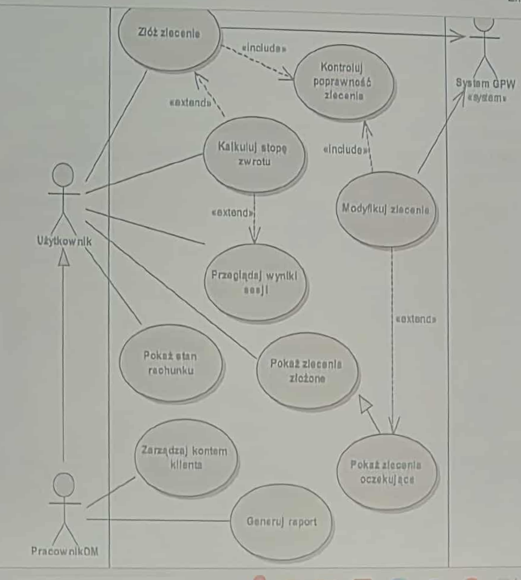

# Zadanie 1: Przykład prowadzącego
> 1. Wymagania
> 2. Struktura diagramu

 

  

# Opis systemu:
Diagram przedstawia relacje między użytkownikami (aktorami) a funkcjonalnościami systemu (przypadkami użycia).
W tym przypadku dotyczy to systemu obsługi zleceń w GPW (Giełdzie Papierów Wartościowych) lub podobnego systemu finansowego, gdzie użytkownik może składać i modyfikować zlecenia inwestycyjne, przeglądać ich stan oraz wyniki sesji.

# Wymagania:
System ma umożliwić użytkownikom przeglądanie, składanie i ewentualne modyfikowanie zleceń inwestycyjnych na Giełdzie Papierów Wartiościowych.
System powinien automatycznie kontrolować poprawność składanych zleceń oraz komunikować się z systemem Giełdy Papierów Wartościowych w celu realizacji zleceń lub ich ewentualnej modyfikacji.
Użytkownik powinien mieć dostęp do podglądu własnych wyników sesji, podglądu własnych zleceń złożonych, podglądu własnego stanu rachunku oraz wyliczenia stopu procentowego zwrotu.
Pracownik DM powinien mieć możliwość zarządzania kontami klientów oraz możliwość generowania raportów.

# Struktura diagramu:
Diagram przypadków użycia przedstawia strukturę interakcji pomiędzy trzema różnymi aktorami: Użytkownikiem, Pracownikiem Domu Maklerskiego oraz Systemem Giełdy Papierów Wartościowych.
Aktorzy korzystają z różnych przypadków użycia reprezentujących funkcjonalności systemu.
Relacje typu "include" oznaczają, że dana czynność zawsze obejmuje inną (np. "modyfikuj zlecenie" zawsze obejmuje "kontroluj poprawność zlecenia").
Relacje typu "extend" wskazują na możliwość rozszerzenia głównego przypadku o dodatkowe działania (np. "modyfikuj zlecenie" może być rozszerzone o "pokaż zlecenia oczekujące").
Diagram odzwierciedla logiczną strukturę funkcji systemu oraz pokazuje, które elementy są współdzielone lub zależne między aktorami.

# Opis elementów diagramu:
## Aktorzy
- Użytkownik: podstawowy aktor korzystający z systemu do składania i zarządzania zleceniami inwestycyjnymi (np. inwestor indywidualny).
Może wykonać następujące czynności:
  - Przeglądać zlecenia
  - Składać zlecenia
  - Modyfikować zlecenia
  - Przeglądać wyniki sesji
  - Przeglądać stan rachunku
  - Wyliczać stopę procentową zwrotu

- Pracownik Domu Maklerskiego: aktor odpowiedzialny za zarządzanie kontami klientów oraz generowanie raportów.
Może wykonać następujące czynności:
  - Zarządzać kontami klientów
  - Generować raporty

- System Giełdy Papierów Wartościowych: zewnętrzny system, z którym komunikuje się nasz system w celu realizacji lub modyfikacji zleceń. Jest powiązany z przypadkiem użycia "Modyfikuj zlecenie".

# Przypadki użycia (Use Cases):

| Przypadek użycia | Znaczenie |
|------------------|-----------|
| Złóż zlecenie | Użytkownik wprowadza nowe zlecenie do systemu. |
| Kontroluj poprawność zlecenia (`<<include>>`) | System automatycznie sprawdza, czy zlecenie jest poprawne (np. dane, format, limity). |
| Kalkuluj stopę zwrotu (`<<extend>>`) | Użytkownik może wyliczyć zwrot z inwestycji jako rozszerzenie procesu składania zlecenia. |
| Przeglądaj wyniki sesji | Użytkownik analizuje rezultaty notowań. |
| Pokaż stan rachunku | Wyświetlenie aktualnego salda i wartości portfela. |
| Pokaż zlecenia złożone / oczekujące | Użytkownik ma wgląd w swoje aktywne i historyczne zlecenia. |
| Modyfikuj zlecenie | Użytkownik (lub system) może zmienić parametry złożonego zlecenia. |
| Zarządzaj kontem klienta | Pracownik DM ma dostęp administracyjny do kont klientów. |
| Generuj raport | Tworzenie raportów z działania systemu lub kont klientów. |

# Typy relacji na diagramie:
| typ relacji | opis | Przykład |
|-------------|------|---------|
| `Association` (asocjacja) | Linia łącząca aktora z przypadkiem użycia – pokazuje, kto korzysta z danej funkcji. | „Użytkownik” → „Złóż zlecenie” |
| `<<include>>` (zawiera) | Jeden przypadek użycia zawsze wywołuje inny, bo jest jego częścią. | „Złóż zlecenie” → „Kontroluj poprawność zlecenia” |
| `<<extend>>` (rozszerza) | Przypadek użycia czasami wywołuje inny (opcjonalnie, np. zależnie od sytuacji). | „Złóż zlecenie” → „Kalkuluj stopę zwrotu” |
| `Dependency` (zależność) | Pokazuje wpływ jednego elementu na inny, często między systemami. | „System GPW” ↔ „Modyfikuj zlecenie” |

  

# Podsumowanie
Diagram przypadków użycia przedstawia kompleksowy obraz interakcji między użytkownikami a systemem obsługi zleceń inwestycyjnych. Pokazuje, jakie funkcje są dostępne dla różnych aktorów oraz jak te funkcje są ze sobą powiązane poprzez różne typy relacji. Dzięki temu można lepiej zrozumieć wymagania systemu oraz sposób jego działania. Diagram ten może służyć jako podstawa do dalszego projektowania systemu, implementacji oraz testowania jego funkcjonalności lub jako dokumentacja dla zespołu deweloperskiego.