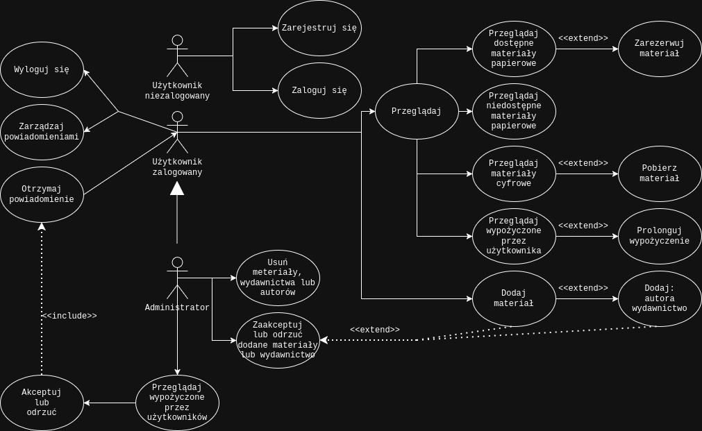

## Zadanie 2: Przykład z pracy dyplomowej (czytelnia)
1. Wymagania
2. Struktura diagramu

# Wymagania funkcjonalne:
Określenie wymagań funkcjonalnych to bardzo ważny etap podczas powstawania różnego rodzaju oprogramowania. Definiują one w jaki sposób będzie działał tworzony system i jak będzie się on zachowywał. Przedstawia cechy i funkcje, które powinna posiadać aplikacja, tak aby potrzeby i oczekiwania użytkownika zostały spełnione w jak największym stopniu. W uproszczeniu można przyjąć, że są to cechy produktu, które są wykrywane przez jego użytkownika. Przykładowo, może to być przycisk na stronie pełniący konkretną, określoną funkcję. System taki nie będzie mógł działać, jeśli nie będą spełnione wszystkie określone wcześniej wymagania funkcjonalne.

Na podstawie analizy istniejących rozwiązań bibliotecznych wybrano najważniejsze cechy, które powinna posiadać tworzona aplikacja. Cechy te zostały podzielone ze względu na stan zalogowania użytkownika oraz jego rolę w systemie.

## Dla użytkownika niezalogowanego system umożliwia:
- zarejestrowanie się i stworzenie konta podając imię, nazwisko, unikalny adres e-mail oraz hasło spełniające wymogi bezpieczeństwa

- zalogowanie się do systemu za pomocą adresu e-mail oraz hasła podanego przy rejestracji.

## Dla użytkownika zalogowanego system umożliwia:
- przeglądanie materiałów bibliotecznych (książki, czasopisma, prace dyplomowe) w formie papierowej udostępnione do wypożyczenia.

- przeglądanie materiałów bibliotecznych w formie cyfrowej udostępnione do pobrania.

- przeglądanie materiałów bibliotecznych w formie papierowej aktualnie niedostępnych (wypożyczonych przez innych użytkowników).

- filtrowanie katalogu stosując kryteria: autor, tytuł, wydawca lub kategoria. Kryteria filtrowania powinny móc być zastosowane osobno lub kilka jednocześnie.

- zarezerwowanie materiałów bibliotecznych dostępnych do wypożyczenia.

- prolongowanie aktualnie trwającego wypożyczenia.

- pobranie materiału bibliotecznego w formie cyfrowej dostępnego do pobrania.

- dodanie za pomocą formularza nowych rekordów do katalogu (bazy danych) materiałów bibliotecznych wymagających zaakceptowania przez administratora.

- dodanie autora do bazy danych za pomocą formularza.

- dodanie wydawnictwa do bazy danych za pomocą formularza.

- otrzymywanie powiadomień o wydarzeniach związanych z wypożyczeniami lub materiałami bibliotecznymi (zaakceptowanie lub odrzucenie dodanego materiału bibliotecznego, zaakceptowanie lub odrzucenie wypożyczenia, przypomnienie o zbliżającym się terminie zwrotu materiału, przypomnienie o upływie terminie zwrotu materiału).

- oznaczanie powiadomień jako odczytane.

- przeglądanie trwających, oczekujących, zakończonych oraz odrzuconych wypożyczeń.

- wylogowanie się z systemu.

## Dla użytkownika administratora system umożliwia:
- przeglądanie materiałów bibliotecznych oczekujących na zatwierdzenie.

- zaakceptowanie lub odrzucenie oczekującego materiału bibliotecznego.

- przeglądanie trwających lub zakończonych wypożyczeń materiałów bibliotecznych wszystkich użytkowników.

- filtrowanie wypożyczeń użytkowników według ich imienia i nazwiska.

- wysyłanie powiadomień przypominających o terminie zwrotu materiału bibliotecznego.

- oznaczanie wypożyczeń jako zakończone.

- przeglądanie wypożyczeń oczekujących na zaakceptowanie.

- zatwierdzanie lub odrzucanie oczekujących wypożyczeń.

- edytowanie informacji o materiałach bibliotecznych w bazie danych.

- usuwanie materiałów bibliotecznych z bazy danych.

- dodanie za pomocą formularza nowych rekordów do katalogu (bazy danych) materiałów bibliotecznych bez potrzeby zatwierdzania.

---

 

Projekt zakłada, że niektóre funkcje użytkownika zalogowanego i administratora są zbieżne. Dotyczą one przeglądania katalogu dostępnych materiałów bibliotecznych czy dodawania autorów i wydawnictw do bazy danych podczas uzupełniania formularza do dodawania nowego rekordu bibliotecznego.

 

# Struktura diagramu:

